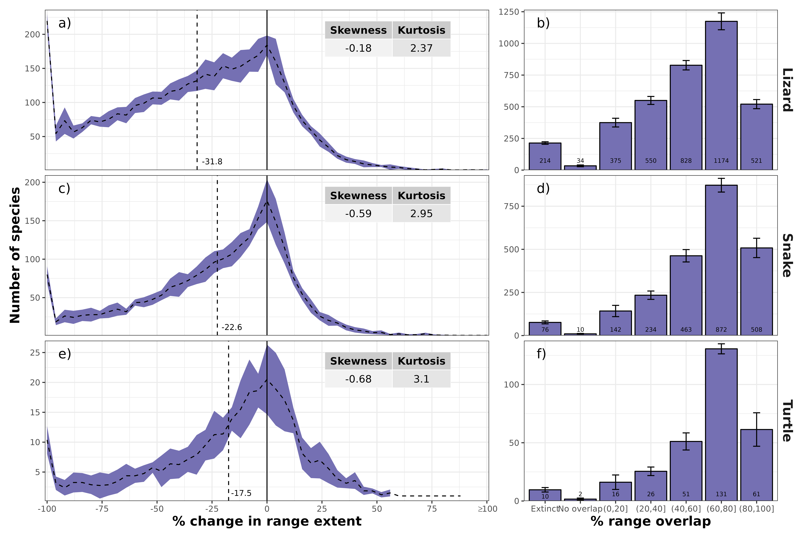

Potential future climate change effects on global reptile distributions
and diversity
================

<!--
output: 
  word_document:
      reference_docx: my-styles.docx
-->

**How to cite this article:** Biber, M. F., Voskamp, A., & Hof, C.
(2023). Potential future climate change effects on global reptile
distribution and diversity. *bioRxiv*.
<https://doi.org/10.1101/2022.05.07.490295>

**Running head:** Global reptiles under climate change

## Abstract

**Aim:** Until recently, complete information on global reptile
distributions has not been widely available. Here, we provide the first
comprehensive climate impact assessment for reptiles on a global scale.

**Location:** Global, excluding Antarctica

**Time period:** 1995, 2050, 2080

**Major taxa studied:** Reptiles

**Methods:** We modelled the distribution of 6,296 reptile species and
assessed potential global as well as realm-specific changes in species
richness, the change in global species richness across climate space,
and species-specific changes in range extent, overlap and position under
future climate change. To assess the future climatic impact on 3,768
range-restricted species, which could not be modelled, we compared the
future change in climatic conditions between both modelled and
non-modelled species.

**Results:** Reptile richness was projected to decline significantly
over time, globally but also for most zoogeographic realms, with the
greatest decrease in Brazil, Australia and South Africa. Species
richness was highest in warm and moist regions, with these regions being
projected to shift further towards climate extremes in the future. Range
extents were projected to decline considerably in the future, with a low
overlap between current and future ranges. Shifts in range centroids
differed among realms and taxa, with a dominating global poleward shift.
Non-modelled species were significantly stronger affected by projected
climatic changes than modelled species.

**Main conclusions:** With ongoing future climate change, reptile
richness is likely to decrease significantly across most parts of the
world. This effect as well as considerable impacts on species’ range
extent, overlap, and position were visible across lizards, snakes and
turtles alike. Together with other anthropogenic impacts, such as
habitat loss and harvesting of species, this is a cause for concern.
Given the historical lack of global reptile distributions, this calls
for a re-assessment of global reptile conservation efforts, with a
specific focus on anticipated future climate change.

**KEYWORDS:** bioclim, biodiversity, environmental niche model, global
warming, ISIMIP, lizard, snake, species distribution model, species
richness, turtle

## Introduction

Emissions from anthropogenic activities have led to an increase in
global surface temperature of around 1°C in the last 100 years. This has
already led to changes in the weather and the occurrence of climate
extremes in every region across the globe ([IPCC, 2021](#ref-IPCC2021)).
Unless emissions are vastly reduced in the coming decades, global
warming will continue and exceed 1.5°-2°C compared to pre-industrial
levels by the end of the 21st century ([IPCC, 2021](#ref-IPCC2021)).

Climate change has already had adverse effects on biodiversity and
ecosystem functioning and these effects are likely to worsen as warming
continues in the future ([IPBES, 2019](#ref-IPBES2019); [IPCC,
2022](#ref-IPCC2022)). Climate change impacts on ecological processes at
scales ranging from genes to entire ecosystems can affect organisms,
populations, or entire communities, and vary between physiological,
morphological, phenological and distributional shifts ([Bellard *et
al.*, 2012](#ref-Bellard2012); [Scheffers *et al.*,
2016](#ref-Scheffers2016)). In particular, changes in species abundance
and distribution due to climate change have already been frequently
observed ([Bowler *et al.*, 2017](#ref-Bowler2017); [Lenoir *et al.*,
2020](#ref-Lenoir2020)), with many species shifting their range towards
higher latitudes and elevations ([Chen *et al.*, 2011](#ref-Chen2011)).
However, some species also respond to climate change through
idiosyncratic range shifts ([Gibson-Reinemer & Rahel,
2015](#ref-Gibson2015)).

In the past most climate change impact assessments on vertebrate
biodiversity have focused on endotherms (birds & mammals). Reptiles,
although they account for a third of global terrestrial vertebrate
diversity, have been largely ignored ([Pacifici *et al.*,
2015](#ref-Pacifici2015)), and previous assessments of climate change
impacts on reptile species have either used only a subset of species
([Warren *et al.*, 2018](#ref-Warren2018); [Newbold,
2018](#ref-Newbold2018)) or have not been of global extent ([Araújo *et
al.*, 2006](#ref-Araujo2006)). Moreover, global biodiversity assessments
often either consider overall effects on a single taxon ([Baisero *et
al.*, 2020](#ref-Baisero2020); [Voskamp *et al.*,
2021](#ref-Voskamp2021)) or compare multiple taxa ([Hof *et al.*,
2018](#ref-Hof2018); [Newbold, 2018](#ref-Newbold2018); [Warren *et
al.*, 2018](#ref-Warren2018); [Thuiller *et al.*,
2019](#ref-Thuiller2019)), but only very rarely compare different
taxonomic groups within one taxon (but see, e.g. [Hof *et al.*,
2011](#ref-Hof2011)).

Reptiles have in the past also often been neglected when assessing
global conservation priorities ([Brooks *et al.*,
2006](#ref-Brooks2006)). They are most diverse in arid and semi-arid
regions, which suggests that their distributions are driven by
ecological and evolutionary processes that differ from other vertebrate
taxa, and these regions have been previously unrecognised as
conservation priorities because other vertebrate taxa could be more
efficiently protected elsewhere ([Roll *et al.*, 2017](#ref-Roll2017)).

While reptiles as a whole have been found to use similar habitats to
mammals and birds ([Cox *et al.*, 2022](#ref-Cox2022)), treating all
reptile species as uniform may be problematic because reptile taxonomic
groups (lizard, snakes and turtles) exhibit large differences in species
richness hotspots ([Roll *et al.*, 2017](#ref-Roll2017)) and habitat
use, making them vulnerable to different anthropogenic impacts ([Cox *et
al.*, 2022](#ref-Cox2022)).

As reptiles are ectothermic, they are likely to be strongly influenced
by climate warming, with some species already experiencing body
temperatures above their physiological optima. This could indicate a
higher vulnerability of these species to climate warming compared to
species from cold environments ([Diele-Viegas & Rocha,
2018](#ref-Diele2018a)). Nonetheless, temperate species are also likely
to be vulnerable, assuming that their physiological adaptations for
living in cold environments may hinder their ability to cope with hotter
climates ([Monasterio *et al.*, 2013](#ref-Monasterio2013)). However,
previous studies assessing climate change impacts on reptile species are
biased towards certain species and taxonomic groups as well as
zoogeographic realms ([Diele-Viegas *et al.*, 2020](#ref-Diele2020)).

The aim of our research was to provide a detailed account of projected
climate change impacts on global reptile distributions and diversity,
looking at species-specific changes as well as broad-scale geographic
trends across and within different taxonomic groups. We assessed changes
in reptile species richness globally, within each zoogeographic realm
and across their respective climate space. For each species, we further
quantified the change in range extent, range overlap and range
distribution and again assessed differences across zoogeographic realms
and taxonomic groups. Given that we cannot model range-restricted
species, we also performed a more general assessment of species-specific
changes in climate space across both modelled and non-modelled species.

## Methods

### Species data

Until recently, global reptile distribution data was unavailable, but
this has changed with the release of the global distribution database by
the Global Assessment of Reptile Distributions (GARD) initiative ([Roll
*et al.*, 2017](#ref-Roll2017)) and more recently the release of the
full set of IUCN reptile range maps ([IUCN, 2022](#ref-IUCN2022)). We
obtained global range maps of 10,064 reptile species from the GARD
initiative ([Roll *et al.*, 2017](#ref-Roll2017)). The range maps cover
lizards, snakes, turtles, worm lizards, crocodiles and the tuatara, but
in this paper, in an approach similar to Roll *et al.*
([2017](#ref-Roll2017)), we only contrast snakes, turtles and
paraphyletic lizards (for simplicity, we subsequently refer to the
latter as lizards).

Range maps were gridded to a 0.5° x 0.5° grid in WGS84, to align with
the available climate data (see next section), considering any grid cell
that intersected with a species’ range polygon as a presence. As range
maps only provide information on a species’ presence but not on a
species’ absence, pseudo-absence data for each species were generated by
randomly selecting grid cells with no presence, using a
distance-weighted approach, where grid cells closer to the range edge
were favoured over grid cells further away (see [Hof *et al.*,
2018](#ref-Hof2018)). The number of absences was either equal to the
number of presences for species with 1000 or more presences or 1000
absences for species with less than 1000 presences because a minimum of
1000 absences considerably increases model performance ([Barbet-Massin
*et al.*, 2012](#ref-Barbet-Massin2012)). For each species we derived 10
replicate sets of pseudo-absences, to account for the variability in
model accuracy because of the random sampling of pseudo-absence data.
Barbet-Massin *et al.* ([2012](#ref-Barbet-Massin2012)) found that
depending on the number of pseudo-absences and model algorithm chosen, 5
to 12 replicates provide the best model quality. Given the relatively
high number of pseudo-absences, 10 replicates should thus result in high
quality for our models. We created a separate model for each of these 10
sets, but the results were then averaged across the 10 sets.

### Climate data

Global bias-corrected daily climate (minimum temperature, maximum
temperature and precipitation) data at a spatial resolution of 0.5°
(WGS84) were obtained from the meteorological forcing dataset
‘EartH2Observe, WFDEI and ERA-Interim data Merged and Bias-corrected for
ISIMIP’ \[EWEMBI; Lange ([2016](#ref-Lange2016))\] for current
conditions (1980 - 2009) and from the Inter-Sectoral Impact Model
Intercomparison Project phase 2b \[ISIMP2b; Frieler *et al.*
([2017](#ref-Frieler2017))\] for future simulations (2036 - 2065 &
2066 - 2095). Future climate simulations were available from four global
circulation models (GCMs; GFDL-ESM2M, HadGEM2-ES, IPSL-CM5A-LR and
MIROC5) and for three representative concentration pathways (RCPs;
RCP2.6, RCP6.0 and RCP8.5) under the Coupled Model Intercomparison
Project Phase 5 (CMIP5). Future climate simulations strongly depend on
the GCM used ([Watterson, 2019](#ref-Watterson2019)). The four GCMs
chosen by ISIMIP2b capture a large range of plausible future climate
projections from all the different GCMs available ([Frieler *et al.*,
2017](#ref-Frieler2017)), while the RCPs represent different emission
scenarios depending on the ongoing and future trajectories of global CO2
emissions ([Van Vuuren *et al.*, 2011](#ref-VanVuuren2011)).

Monthly means of each climate variable over the respective 30-year time
periods, centred around 1995, 2050 and 2080, and for each future
scenario (GCM & RCP) were used to calculate 19 bioclimatic variables
(see Table S1.1 in Appendix S1 in Supporting Information) using the
biovars() function of the ‘dismo’ package ([Hijmans *et al.*,
2021](#ref-Hijmans2021)) in R ([R Core Team, 2021](#ref-R2021)).
Bioclimatic variables represent annual trends, seasonality and extreme
or limiting environmental factors and are thus more biologically
meaningful variables than temperature or precipitation alone.

### Species Distribution Models (SDMs)

Species distribution models (SDMs) are a common way of assessing
species-specific responses to climate change ([Guisan & Thuiller,
2005](#ref-Guisan2005)), but are also used to assess climate change
impacts on biodiversity ([Thuiller *et al.*, 2005](#ref-Thuiller2005)).
SDMs statistically infer a relationship between the observed
distribution of a species and the underlying environmental conditions
([Elith & Leathwick, 2009](#ref-Elith2009)), and can then be used to
project current distributions into the future ([Elith *et al.*,
2010](#ref-Elith2010)), assuming that the species maintains its climatic
niche ([Wiens & Graham, 2005](#ref-Wiens2005)). By doing this for
multiple species, these projections can be combined to assess future
changes in species richness (e.g. [Hof *et al.*, 2018](#ref-Hof2018)).

We fitted species distribution models using the presence/pseudo-absence
data of a species as response variable and the derived bioclimatic
variables for current (1995) conditions as explanatory variables. The
number and choice of explanatory variables used strongly influences the
outcome of the SDMs ([Petitpierre *et al.*,
2017](#ref-Petitpierre2017)). We thus performed a rigorous variable
selection approach. After pre‐selecting the 10 most commonly used
variables from the literature (see [Porfirio *et al.*,
2014](#ref-Porfirio2014)), all potential combinations of three and four
bioclimatic variables with a low Pearson correlation (r ≤ 0.7) were used
to model 10 % of all species (N= 987), which were randomly selected,
using a Generalised Additive Model (GAM) approach (see [Hof *et al.*,
2018](#ref-Hof2018)). The model performance of the different variable
combinations was tested and models for all species were fitted using the
best-performing variable combination, which was temperature seasonality,
maximum temperature of the warmest month, annual precipitation and
precipitation seasonality (see Fig. S1.1).

Projections based on SDMs vary considerably among model algorithms
([Thuiller *et al.*, 2019](#ref-Thuiller2019)), therefore we fitted two
different modelling algorithms with good performance and discrimination
capacity ([Meynard & Quinn, 2007](#ref-Meynard2007); [Elith *et al.*,
2010](#ref-Elith2010)), an additive model (GAM) and a regression tree
based model (Generalized Boosted Regression Models (GBM)).

GAMs were fitted with a Bernoulli response, a logit link and thin-plate
regression splines using the ‘mgcv’ package ([Wood,
2003](#ref-Wood2003), [2011](#ref-Wood2011)) in R ([R Core Team,
2021](#ref-R2021)). GBMs were fitted with the ‘gbm’ package ([Greenwell
*et al.*, 2020](#ref-Greenwell2020)) in R ([R Core Team,
2021](#ref-R2021)) and the optimal parameter settings for learning rate
(0.01 and 0.001), tree complexity (1, 2 and 3) and number of trees
(1000-10000) for each species were identified by cross-validation
([Bagchi *et al.*, 2013](#ref-Bagchi2013)).

Spatial autocorrelation in species distributions can bias parameter
estimates and error probabilities ([Kühn, 2007](#ref-Kuhn2007)). Two
different methods were used to account for spatial autocorrelation in
the SDMs. Species with equal or more than 50 presences were modelled
using an ecoregion-blocking approach. Here the world was divided into 10
blocks based on a representative subset of the climate space across each
of the world’s ecoregions ([Olson *et al.*, 2001](#ref-Olson2001);
[Bagchi *et al.*, 2013](#ref-Bagchi2013)). Subsequently, 10 models per
species were built leaving out one block at a time, using the left-out
block for model evaluation ([Bagchi *et al.*, 2013](#ref-Bagchi2013)).
For species with 10 to 49 presences, we split the data into 10 datasets
by repeatedly randomly selecting 70% of the data, then using the
left-out 30% for model evaluation. Species occurring in less than 10
grid cells (N = 3602, Table 1) were not modelled because the sampling
size would be too low to produce meaningful results ([Hernandez *et
al.*, 2006](#ref-Hernandez2006)). Together with the 10 different
pseudo-absence sets this resulted in 100 models for each model algorithm
and species.

The performance of the fitted SDMs was evaluated by calculating the
overall AUC for each species (the average AUC across the 10 blocks and
the 10 sets of pseudo-absences). Models with an overall AUC smaller than
0.7 were dropped (N = 166), which left us with SDMs for 6296 reptile
species (see Fig. S1.2), which represents 62.6 % of the total number of
available species from GARD (Table 1). In addition to assessing the
model fit of the individual models, we also compared the observed
species richness with the projected current richness per grid cell (Fig
S1.3) in order to assess the performance of all our models when looking
at changes in species richness.

The same modelling approach has been used previously to assess climate
change impacts on amphibians, birds and mammals, see Hof *et al.*
([2018](#ref-Hof2018)) and Biber *et al.* ([2020](#ref-Biber2020)). The
former provides a more detailed explanation of the modelling
methodology, while the latter gives a thorough account of the caveats
and uncertainties associated with species distribution models.

### Future projections

Future species distributions were projected using the future bioclimatic
variables for the two future time periods (2050, 2080), each GCM
(GFDL-ESM2M, HadGEM2-ES, IPSL-CM5A-LR and MIROC5), each RCP (RCP2.6,
RCP6.0 and RCP8.5) and both model algorithms (GAM & GBM). Model results
are presented as the ensemble mean across the four GCMs and two model
algorithms (GAM & GBM) considered.

Future projections of each species were limited to the extent of their
original and the neighbouring ecoregions to prevent predictions of areas
with analogue climatic conditions. Future projections were further
limited by applying a species-specific dispersal buffer. For most
species considered in this paper, species-specific dispersal distances
are still unknown ([Nathan *et al.*, 2012](#ref-Nathan2012)), hence we
used species-specific dispersal buffers which were based on the diameter
(d) of the largest range polygon of a species. We used three
species-specific dispersal scenarios (d/4, d/8, d/16, see Fig. S1.4) and
provide a detailed comparison of these in the Supporting Information
(see Appendix S5). Here we provide results under a medium dispersal
scenario (d/8), which corresponds to a mean dispersal distance of 2.4 km
per year.

### Impact analysis

The current and future probabilities of occurrence of the individual
SDMs were thresholded into binary presence-absence data using
species-specific thresholds according to the true skill statistic
\[MaxTSS; Allouche *et al.* ([2006](#ref-Allouche2006)); Fig. S1.5 d\].
Thresholded species occurrences were then used to calculate current and
future species richness, as well as richness increase, decrease, change
and relative change (%). Richness increase and decrease were identified
by using the presence information of each individual species and then
summing up the number of species that newly occur in a given grid cell
(species increase) or species that disappear from the respective grid
cell (species decrease).

Summing up the thresholded species occurrences frequently overestimates
species richness ([Calabrese *et al.*, 2014](#ref-Calabrese2014)), thus
we also present the results using the sum of the raw non-thresholded
probabilities of occurrence of each species in the Supporting
Information (see Appendix S4).

We calculated the projected species richness for each cell of a global
grid of 0.5° x 0.5° resolution globally as well as for each
zoogeographic realm, as defined by Holt *et al.*
([2013](#ref-Holt2013)), for each time period. We then tested for
significant changes in species richness over time using a paired t-test
with Holm correction. To assess how species richness and richness
changes are related to the overall change in climatic conditions, we
assessed both against univariate temperature and precipitation as well
as the interaction of temperature and precipitation conditions. To
assess potential future climate effects on individual species, we
quantified the percentage of change in range extent, the percentage of
range overlap and the direction and distance in range shift. The
percentage of change in range extent was calculated based on the
projected current and future range extent of a species (Fig. S1.5 f).
The percentage of range overlap was calculated by extracting the total
area of spatial range overlap between the projected current and future
range extent and dividing it by the projected current range extent (Fig.
S1.5 g). To assess the magnitude of the range shift for each species, we
derived the range centroid for both time periods and calculated the
distance and direction of the projected range shift (Fig. S1.5 g).

Given that 37.4% of all reptile species for which data were available
could not be modelled (largely due to their restricted range extent,
Table 1), we performed an additional analysis considering all 10,064
species for which data were available. We used the same 4 bioclimatic
variables used for the SDMs to transform the multidimensional climate
data to a two-dimensional climate space using the first two axes of a
principal component analysis (PCA). PCAs were performed for both current
and future conditions, taking into consideration the same GCMs, RCPs,
and time periods as previously. The explained variance of the first two
PCA axes was above 75 % under all scenarios (Fig. S1.6). For each
scenario combination, we then calculated the Euclidean distance between
the two PCA axes of current and future conditions, to obtain a measure
of climatic change (Fig. S1.7). We then extracted the climatic distance
for the gridded locations of each species and compared the climatic
distance of modelled and non-modelled (range-restricted) species using a
non-paired t-test with Holm correction.

Where no specific groups (lizards, snakes, turtles) are mentioned, we
present the results for all reptile species together. Nevertheless,
Appendix S2 presents group-specific results. Results are presented for
the year 2080 under a medium representative concentration pathway
(RCP6.0). A sensitivity analysis with regards to the variation across
years and RCPs is shown in the Supporting Information (see Appendix S6).

## Results

### Spatial changes

Projected reptile richness (sum of thresholded SDM projections) based on
a resolution of 0.5° x 0.5° for current conditions varied between 0 at
high latitudes and 251 in the tropics, with particular hotspots in
Brazil, Cameroon and Indonesia (Fig. 1a). Overall, reptile richness was
dominated by lizard species (N = 3695), followed by snakes (N = 2305),
while turtle species only contributed marginally to the total number of
modelled species (N = 296, Table 1, Fig. 1b).

For future conditions, a large number of reptile species were projected
to disappear and at the same time a large number of new species were
projected to appear in Brazil and Australia, while other regions showed
either a strong species decrease or increase (Fig. 1 c, d). The greatest
future decreases of species richness were projected east of the Caspian
Sea and in South Africa (Fig. 1 c), while strong future increases were
projected in the south-west of China and in the eastern United States
(Fig. 1 d). Overall, the projected richness decrease was greater than
the richness increase, which resulted in a greater net loss in species
richness from 1995 to 2080 (Fig. 1 c, d, e). The lowest net loss in
species richness was projected for Brazil, Australia and South Africa,
while the highest net gain was projected for south-west China and the
western United States (Fig. 1 e). Relative change (%) was projected to
be negative - in particular for most of the southern hemisphere, while
the high northern latitudes showed a strong positive relative change
(Fig. 1 f).

Spatial patterns in species richness changes varied greatly across the
three taxa, with lizards seeing both strong increases and decreases in
Australia, snakes showing a strong decrease in South America and turtles
seeing a strong increase in the eastern part of North America (Fig. S2.9
& Fig. S2.11). All three taxa showed a net gain in species richness in
northern latitudes, while lizards showed the greatest net loss in parts
of Australia, snakes in large parts of South America and turtles in
parts of South America and southern Africa (Fig. S2.10 & Fig. S2.12).

### Global and zoogeographic realm changes

Summed up across all 0.5° x 0.5° grid cells globally, species richness
was projected to decline significantly (p \< 0.01) from 1995 to 2080
globally, with a decline in mean reptile richness per grid cell from
58.4 ± 0.24 (SE) in 1995 to 53.39 ± 0.19 in 2080 (Fig. 1b, Fig. 2 a). 8
out of 11 zoogeographic realms showed a significant decline in reptile
richness by 2080 (Fig. 2 b, c, d, f, g, h, j, k), while the Nearctic and
Palearctic realms showed a significant increase (Fig. 2 e, i) and the
Sino-Japanese realm showed no significant change (Fig. 2 l).

Looking at the global averages of species richness for each 0.5° grid
cell for the three reptile groups separately, snakes had the highest
mean species richness (μmean = 30.4 ± 0.15), followed by lizard (μmean =
24.3 ± 0.09 SE) and turtle richness (μmean = 3.71 ± 0.02 SE; Fig. 1b,
Fig. S2.8). Globally, similar to the total reptile richness, the
individual taxonomic groups (lizards, snakes and turtles) all showed a
significant decline in species richness, while there were slight
differences across the individual realms (Fig. S2.13 – S2.15). Lizards
only showed a significant increase in richness in the Palearctic realm
and no significant change in richness in the Sino-Japanese realm, while
in all other realms they showed a significant decrease (Fig. S2.13).
Snake and turtle richness increased significantly in the Nearctic and
Palearctic realms. Snake richness decreased significantly in all other
realms apart from the Sino-Japanese one (Fig. S2.14), while turtle
richness significantly decreased in all other realms apart from the
Saharo-Arabian and the Sino-Japanese one (Fig. S2.15).

### Biophysical changes

Reptile richness varied greatly across conditions with varying
combinations of temperature and precipitation (Fig. 3 a, b, c). For
1995, reptile richness was projected to be highest in areas with a
temperature of about 28.5°C, a precipitation of about 5500 mm and when
considering temperature and precipitation together in warm and moist
regions (21°C & 3000 mm, Fig. 3 c). The climatic conditions with the
highest richness shifted to even more extreme (warmer & wetter) novel
climate conditions by 2080 (Fig. 3 a, b, d).

Looking at the species richness change across the 2-dimensional climate
space, net change was positive at the upper precipitation limits across
all temperatures and the very hot and very dry conditions and negative
throughout the entire precipitation range especially for the higher
temperatures. Overall, the negative change was much greater and more
pronounced than the positive net change (Fig. 3 e). The highest positive
and negative relative change values were clustered, both occurred at the
upper precipitation limits at low and medium temperatures (Fig. 3 f). A
considerable percentage of the climate space (29.5 %) was shifting
towards novel climatic conditions, for which no change in species
richness could be estimated, while only few discrete climatic conditions
as well as very cold & very dry conditions (4.75 %) got lost (Fig. 3 e,
f).

### Species-specific range changes

The range extent of most species (N = 6021) showed a considerable
decrease (μmean = -27.7 ± 0.16 SE, Fig. 4 a, c, e). Lizard species
showed the greatest decline (μmean = -31.8 ± 0.22 SE) in range extent
(Fig. 4 a), followed by snakes (μmean = -22.6 ± 0.25 SE), while almost
equal numbers of turtle species showed a decline (N = 274) and an
increase (n = 205) with decreases being much more pronounced than
increases (μmean = -17.5 ± 0.72 SE, Fig. 4 e). Almost half of the
modelled reptile species (N = 3029) showed a strong change in range
position, demonstrated by a relatively low range overlap (\<= 60 %),
which was consistent across all three groups (Fig. 4 b, d, f).

Most of the range centroids (58 %) of all reptile species fell within
the Neotropical (N = 1133), Afrotropical (N = 1039), Oriental (N = 785)
and Australian realm (N = 698). Turtle species had 50 % of their range
centroids in the Nearctic (N = 58), Oriental (N = 53) and Afrotropical
realm (N = 38), while lizards and snakes reflected the overall, total
reptile patterns (Fig. 5 d). Range centroids were highly clustered
within the different realms, which reflects the overall richness
hotspots, and hardly any centroids were found in the high northern
latitudes (Fig. 5 d). By 2080 species centroids were projected to shift
by a mean distance of 111 km ± 0.9 SE primarily towards the South.
Lizards showed a shift in all directions, with a slightly greater number
of species exhibiting a shift towards the South (Fig. 5 a), while snakes
and turtles showed a more pronounced shift of species towards the North
(Fig. 5 b, c). Turtle ranges shifted by the largest distances, followed
by snakes (Fig. 5 a, b, c). The northern realms (Nearctic,
Saharo-Arabian, Palearctic und Sino-Japanese) showed a dominant shift
towards the North, while the southern realms (Neotropical, Afrotropical
and Australian) showed a dominant shift towards the South. This was also
reflected in the taxon-specific range shifts for the Northern and
Southern hemisphere (Fig. S3.16 in Appendix S3). The Panamanian,
Madagascan and Oriental realms also showed a northerly shift, while the
Oceanian realm showed a bi-directional shift to the Northwest and
Southeast (Fig. 5 d, Fig. S3.17). Large realms had a greater percentage
of species that shifted their range over a greater distance (Fig. 5,
Fig. S3.17).

### Non-modelled species

37.4 % of reptile species for which data would have been available could
not be modelled using SDMs, either due to a small sample size or a low
model performance (Table 1). We found that the species that could not be
modelled showed a significantly greater (p \< 0.05) mean climatic
distance between current and future conditions than did the modelled
species and thus occurred in areas that are projected to experience a
greater change in climatic conditions. This pattern was consistent
across all three taxa

### Sensitivity analysis

Looking at the sum of occurrence probabilities, we found similar spatial
patterns and a similar magnitude of change compared to the sum of
thresholded occurrences (species richness) (Fig. S4.18 - S4.20).
Projected richness values and their future changes were slightly higher
assuming a larger dispersal ability (d/4), but on the whole all results
were consistent across the three dispersal scenarios considered (Fig.
S5.21 - S5.26). Climate change impacts on future species richness
increased over time, with greater effects seen for 2080 than 2050, and
the greatest impacts being observed under a high emission scenario
(RCP8.5) compared to the two lower scenarios (Fig. S6.27 - S6.38).

## Discussion

Reptile richness was projected to decrease significantly across most
parts of the world in the future (Fig. 1 & 2). This effect was apparent
for lizards, snakes and turtles alike, although regional and
species-specific responses differed across the three groups (Fig. S2.8 –
S2.12).

### Spatial changes

Reptile richness is projected to decrease in Brazil, Australia and South
Africa (Fig. 1 c, e). These areas overlap significantly with the biotic
convergence zones, areas with a high spatial concentration of
Lepidosaurians (i.e. snakes and lizards) identified by Diele-Viegas *et
al.* ([2020](#ref-Diele2020)), which were also found to cover a large
number of the Lepidosaurian species vulnerable to climate change
([Diele-Viegas *et al.*, 2020](#ref-Diele2020)). Huey *et al.*
([2012](#ref-Huey2012)) further found that ectotherms sharing climate
vulnerability traits seem to be concentrated in lowland tropical
forests. Combining climate-based SDMs with land-use change information,
Newbold ([2018](#ref-Newbold2018)) created future projections for 20938
vertebrate species and found that Brazil is strongly affected by
vertebrate diversity loss due to climate change, and, together with
Australia, is also likely to be strongly affected by future land-use
changes, especially under a high-emission scenario (RCP8.5). Given that
Brazil in particular does not only host a high reptile richness \[Roll
*et al.* ([2017](#ref-Roll2017)); Fig. 1 a\], but has recently been
found to host a large number of threatened reptile species ([Cox *et
al.*, 2022](#ref-Cox2022)), this highlights the responsibility of this
mega-diverse country for protecting reptile diversity. South-western
China and the western United States were projected to show a net gain in
reptile richness under climate warming (Fig. 1 e), but they also belong
to those areas where most reptile species are threatened by habitat loss
from agriculture and logging or the harvesting of species ([Böhm *et
al.*, 2013](#ref-Bohm2013)). These projected losses due to habitat
change could potentially counteract any positive effects climate warming
might have.

The high variation in species richness changes across regions and taxa
that we found obviously reflects their original richness patterns.
Species richness of amphibians, birds and mammals together is a good
spatial surrogate for species richness of all reptiles combined and of
snakes, but is not a good surrogate for lizard or turtle richness ([Roll
*et al.*, 2017](#ref-Roll2017)). Thus, it is not surprising that the
areas with the highest decline in overall reptile richness (see Fig. 1)
overlap significantly with the areas of highest projected changes in
vertebrate species richness (amphibians, birds and mammals) found by Hof
*et al.* ([2018](#ref-Hof2018)), although global reptile richness is
largely constrained by temperature, while global richness of all other
vertebrate groups is primarily constrained by the availability of energy
and water ([Qian, 2010](#ref-Qian2010)). Further, historical shifts in
geographic ranges and climatic niches have further demonstrated that
niche shifts in endotherms are significantly faster than in ectotherms
([Rolland *et al.*, 2018](#ref-Rolland2018)).

### Global and zoogeographic realm changes

Globally reptile richness was projected to decline significantly, from
an average of about 58 to about 53 (9.4 %) species per grid cell from
1995 to 2080 (Fig. 2 a). This projected percentage change in average
future reptile richness (9.4 %) is considerably lower than the reptile
richness decline due to climate warming predicted by Newbold
([2018](#ref-Newbold2018)). However, while Newbold
([2018](#ref-Newbold2018)) also used SDMs to infer future reptile
richness changes, he used only a subset of reptile species, for which
IUCN range maps were available at that time. In addition, he also
applied a much smaller dispersal buffer (0.5 km per year), which might
indicate that our projections provide a rather optimistic scenario.
Newbold ([2018](#ref-Newbold2018)) also found that reptiles, together
with amphibians, are disproportionately sensitive to future human
land-use. Given the synergistic effect of future climate and land-use
changes on biodiversity ([Brook *et al.*, 2008](#ref-Brook2008)) as well
as species populations ([Williams *et al.*, 2022](#ref-Williams2022)),
land-use change is likely to further exacerbate climate change impacts
on global reptile distribution and diversity.

Changes in reptile richness differed among zoogeographic realms, but
species richness declined significantly across most realms over both
time periods (Fig. 2 b, c, d, f, g, h, j, k). Lizards, snakes and
turtles all showed similar declines in species richness globally and
across most realms, but differed slightly across individual realms. This
is in line with a previous study covering various realms from tropical
to temperate regions which found that 60 % of assessed Lepidosaurian
species (N = 1114) were vulnerable to changes in climate ([Diele-Viegas
*et al.*, 2020](#ref-Diele2020)). Diele-Viegas *et al.*
([2020](#ref-Diele2020)) further found that the Afrotropical, Nearctic
and Sino-Japanese realms were the three realms where Lepidosaurians were
most vulnerable to climatic change, while Lepidosaurians in the
Madagascan and Oceanian realm were least vulnerable. By contrast, we
found no significant decline in projected total reptile richness for the
Sino-Japanese realm (Fig. 2 l), although individual subgroups were
projected to show a significant decline in species richness from 1995 to
2050 (Fig. S2.13 – S2.15). Both the Madagascan and Oceanian realm were
further projected to significantly decrease in species richness
including for all reptile species (Fig. 2 d, g) and all three subgroups
(Fig. S2.13 – S2.15). However, given that the Madagascan realm,
specifically, boasts over 90% of endemic reptile species and genera
([Glaw & Vences, 2007](#ref-Glaw2007)) and that both realms are composed
of island territories which are usually considered highly vulnerable to
climate change and might also be affected by future sea level rise and
erosion ([Diele-Viegas *et al.*, 2020](#ref-Diele2020)), our estimates
might still underestimate potential climate change impacts in these
realms. Interestingly, turtle richness seemed to be least affected by
climate change, when looking at the different realms (Fig. S2.15),
although a recent review has deemed turtles as the vertebrate group with
the highest extinction risk, as it is strongly affected by habitat loss,
human consumption and pet trading ([Stanford *et al.*,
2020](#ref-Stanford2020)).

### Biophysical changes

Reptile richness differed significantly with temperature and
precipitation, with the highest richness being observed in warm and
moist conditions. Under future climate change scenarios, the climatic
conditions with high species richness were projected to shift to even
more extreme (warmer & wetter) conditions (Fig. 3). This gives cause for
concern given that tropical forest and desert lizards already live in
environmental conditions that are close to their thermal limits
([Sinervo *et al.*, 2010](#ref-Sinervo2010)), while desert and temperate
lizard species have been found to be less able to regulate their
temperature in order to deal with heat stress than tropical species
([Anderson *et al.*, 2022](#ref-Anderson2022)). Reptiles cannot regulate
their body temperature internally, so are strongly dependent on using
solar energy captured by the environment to regulate their body
temperature ([Huey, 1982](#ref-Huey1982)). This might lead to
overheating when temperatures go beyond a species’ critical limit, which
makes them particularly susceptible to climatic changes ([Sinervo *et
al.*, 2018](#ref-Sinervo2018)). However, this might be compensated by
other biological processes that help species to buffer climate change
effects, i.e. genomic and phenotypic plasticity ([Rodrı́guez *et al.*,
2017](#ref-Rodriguez2017)) as well as behavioral and physiological
adaptation ([Sunday *et al.*, 2014](#ref-Sunday2014)). Overall, the
persistence of reptile species would be much more affected by climate
cooling than warming, but it has been suggested that increasing
droughts, which will be a consequence of continued warming, pose a
significant future threat to European reptiles ([Araújo *et al.*,
2006](#ref-Araujo2006)). It is likely that climate warming will have an
additional impact on reptiles that have temperature-dependent sex
determination. Altered sex ratios will not only result in a higher
extinction risk for local populations, but, together with a reduction in
nesting sites due to habitat destruction and fragmentation, will also
affect the dispersal and potential range expansion of a species.
Therefore it could also have an impact on population demography and size
unless temperature shifts in sex determination or female nest-site
choice evolves in pace with rising temperatures ([Boyle *et al.*,
2016](#ref-Boyle2016); [Gibbons *et al.*, 2000](#ref-Gibbons2000)).

### Species-specific range changes

The range extent of most species were projected to considerably
decrease, with lizard species showing the greatest decline (Fig. 4 a).
Further, most reptiles also showed a strong decline in range overlap,
which was consistent across all three groups (Fig. 4). This is in line
with results by Warren *et al.* ([2018](#ref-Warren2018)), who found
that projected future range losses of more than 50% occur in 8 - 52% of
considered reptile species by 2100 depending on the climate scenario
considered, although this study included only a fraction of all reptile
species (N=1850) and no species dispersal was considered.

Compared to other terrestrial vertebrate groups (especially birds and
mammals), reptiles have small geographic ranges, which also indicates
narrower niche requirements. This is not only likely to make them more
susceptible to future climate change ([Newbold,
2018](#ref-Newbold2018)), but also to other threats such as habitat loss
or invasive species ([Böhm *et al.*, 2013](#ref-Bohm2013); [Cox *et
al.*, 2022](#ref-Cox2022)). Reptiles are a paraphyletic class with a
diverse range of body forms, habitat affinities and functional roles
([Pincheira-Donoso *et al.*, 2013](#ref-Pincheira2013)), which will
probably result in their response to climatic and habitat changes being
equally varied. In addition, cascading effects generated by disease,
invasive species, habitat loss and climate change might lead to declines
of sympatric species and a faster deterioration of ecosystem structure
than anticipated for climate change alone ([Zipkin *et al.*,
2020](#ref-Zipkin2020)).

The majority of reptile species showed projected shifts towards the
South, which was largely driven by range shifts in lizards (Fig. 5).
Comparing the Northern and Southern hemispheres (Fig. S3.16), we found a
clear overall poleward shift in species ranges across all three groups,
which has also been found previously in various other taxonomic groups
([Chen *et al.*, 2011](#ref-Chen2011)). Turtle ranges were projected to
shift farthest, followed by snakes (Fig. 5). The relatively short range
shift distances in lizard species are probably due to the fact that
lizards have the smallest range extents across the three groups ([Roll
*et al.*, 2017](#ref-Roll2017)), which, given that our dispersal buffers
are based on range extent, also resulted in smaller dispersal distances
for lizards compared to the two other groups (Fig. S1.4). This is,
however, obviously somewhat counter-intuitive and in stark contrast to
generally perceived differences in mobility characteristics
(e.g. movement speed) among lizards, snakes and turtles. While it is
hard to tackle this problem in a globally and taxonomically
comprehensive study like ours, it underlines the need for more efforts
in collecting data on actual, empirically quantified dispersal distances
in order to consider them in SDM exercises and large-scale
biogeographical analyses.

### Non-modelled species

Range-restricted (non-modelled) species were projected to experience
significantly higher shift in climatic distance than modelled species
(Fig. 6), indicating that range-restricted species are also likely to be
strongly affected by climate change. This highlights once more that
sample size restrictions of SDMs are likely to downplay climate change
effects on narrow-ranging and threatened species ([Platts *et al.*,
2014](#ref-Platts2014)). Hof *et al.* ([2018](#ref-Hof2018)) also found
significant impacts of climate and land-use changes on range-restricted
vertebrate species, excluding reptiles. However, similar to the latter
study, we only looked at climate anomalies (Euclidean distance between
current and future climatic conditions) as a metric of climate change,
while different metrics have been found to indicate contrasting climate
change patterns on a global scale ([Garcia *et al.*,
2014](#ref-Garcia2014)). In addition to climate change effects, habitat
modification has been found to have a greater impact on range-restricted
reptile species, as well as species with a small clutch size ([Doherty
*et al.*, 2020](#ref-Doherty2020)). Range-restricted reptile species are
further often evolutionarily unique ([Murali *et al.*,
2021](#ref-Murali2021)) and have been found to overlap least with
current conservation priority areas ([Roll *et al.*,
2017](#ref-Roll2017); [Cox *et al.*, 2022](#ref-Cox2022)).

### Sensitivity analysis

Our results were strongly dependent on the dispersal assumption, time
period and emission scenario (RCP) considered (see Appendices S5 & S6).
As expected, the overall patterns and richness changes were more
pronounced in a later time period and scenarios representing higher
levels of greenhouse gas emissions, as these reflect potential futures
with a higher level of climate warming. Thuiller *et al.*
([2019](#ref-Thuiller2019)) have previously assessed the uncertainty
originating from dispersal, model algorithm, GCM and RCP on the future
biodiversity scenario of amphibians, birds and mammals and found that
model algorithm and RCP have the greatest influence.

On the contrary, greater dispersal distances imply that reptile species
are able to move greater distances in order to track their optimal
climatic niche and thus provide more optimistic potential changes in
species occurrence and richness patterns. Reptile-specific studies have
either considered no dispersal at all ([Araújo *et al.*,
2006](#ref-Araujo2006); [Warren *et al.*, 2018](#ref-Warren2018)) or a
dispersal rate of 0.5 km per year ([Newbold, 2018](#ref-Newbold2018)).
We use species-specific dispersal buffers with an average of 2.4 km per
year (Fig. S1.4). While these buffers might be optimistic, they are
based on the transparent rationale of a range-size dependent dispersal
buffer, i.e. species with a small range size have a smaller dispersal
buffer than species with a large range size, which avoids the unlikely
assumption of uniform dispersal distances across species. Given that our
model results, as well as the underlying climate scenarios, are based on
a 0.5° grid size (about 50 x 50 km), small differences in dispersal
distance do not have a strong impact on our results (see Appendix S5).
Nevertheless, these considerations again highlight the challenges in
sensibly accounting for the influence of dispersal in global climate
impact assessments on species distributions and diversity.

The projected changes in species distributions help to investigate
potential changes in global reptile richness patterns and in
highlighting potential hotspots of climate change impacts. They also
allow comparison of climate change vulnerability across taxonomic groups
and help to identify areas where conservation efforts might be most
urgently needed ([Voskamp *et al.*, 2022](#ref-Voskamp2022a)). However,
SDMs are always simplifications and the resulting projections need to be
interpreted with caution.

To improve SDMs, future studies should try to consider additional
factors, such as biotic interactions ([Schleuning *et al.*,
2020](#ref-Schleuning2020)) and the reshuffling of species communities
([Voskamp *et al.*, in prep](#ref-Voskamp2022b)), which might lead to a
change in competitive balance ([Ockendon *et al.*,
2014](#ref-Ockendon2014)), altered predator-prey relationships ([Harley,
2011](#ref-Harley2011)) or changes in functional diversity ([Stewart *et
al.*, 2022](#ref-Stewart2022)) and thus the provision of ecosystem
functions and services ([Pecl *et al.*, 2017](#ref-Pecl2017)). While the
above factors might improve climate change impact projections in the
future, such modelling exercises will never reflect the truth, as a
species’ response to climate change will be strongly influenced by
behaviour, diel rhythm, thermoregulatory potential and microclimatic
conditions ([Anderson *et al.*, 2022](#ref-Anderson2022)). This
complexity highlights the need for integrative approaches when
investigating species’ responses to climate change ([Hof,
2021](#ref-Hof2021)).

## Conclusion

Our study shows that reptiles are not only likely to be impacted by
future climate change, globally but also within most zoogeographic
realms. These impacts are projected to have a considerable effect on the
extent and location of species’ geographic ranges. Thus, to prevent
large scale declines in reptile species, not only is it of key
importance to lower CO2 emissions in order to stop on-going climate
change, but also to maintain adequate habitats of sufficient size and
quality, especially grassland and savanna habitats ([Roll *et al.*,
2017](#ref-Roll2017)). Furthermore, it is necessary to establish new
protected areas that will help to prevent the extinction of particularly
vulnerable species, i.e. by establishing high-elevation climate refugia
within current species ranges ([Sinervo *et al.*,
2018](#ref-Sinervo2018)).

## Data Accessibility Statement

GARD range maps are available from
**<https://doi.org/10.5061/dryad.83s7k>**. EWEMBI and ISIMIP2b climate
data are available from
**<https://data.isimip.org/10.5880/pik.2019.004>** and
**<https://data.isimip.org/search/query/ISIMIP2b%20Input/tree/ISIMIP2b/InputData/climate/atmosphere/>**
respectively. The code for the species distribution models can be found
at **<https://github.com/christianhof/BioScen1.5_SDM>**, whereas the
code and data for the performed data analysis and the presented figures,
can be found on Dryad (doi: 10.5061/dryad.rn8pk0pgb, [Biber *et al.*,
2023](#ref-Biber2023)).

## References

Allouche, O., Tsoar, A. & Kadmon, R. (2006) Assessing the accuracy of
species distribution models: Prevalence, kappa and the true skill
statistic (TSS). *Journal of Applied Ecology*, **43**, 1223–1232.

Anderson, R.O., Meiri, S. & Chapple, D.G. (2022) The biogeography of
warming tolerance in lizards. *Journal of Biogeography*.

Araújo, M.B., Thuiller, W. & Pearson, R.G. (2006) Climate warming and
the decline of amphibians and reptiles in europe. *Journal of
Biogeography*, **33**, 1712–1728.

Bagchi, R., Crosby, M., Huntley, B., Hole, D.G., Butchart, S.H.,
Collingham, Y., Kalra, M., Rajkumar, J., Rahmani, A., Pandey, M. &
others (2013) Evaluating the effectiveness of conservation site networks
under climate change: Accounting for uncertainty. *Global Change
Biology*, **19**, 1236–1248.

Baisero, D., Visconti, P., Pacifici, M., Cimatti, M. & Rondinini, C.
(2020) Projected global loss of mammal habitat due to land-use and
climate change. *One Earth*, **2**, 578–585.

Barbet-Massin, M., Jiguet, F., Albert, C.H. & Thuiller, W. (2012)
Selecting pseudo-absences for species distribution models: How, where
and how many? *Methods in Ecology and Evolution*, **3**, 327–338.

Bellard, C., Bertelsmeier, C., Leadley, P., Thuiller, W. & Courchamp, F.
(2012) Impacts of climate change on the future of biodiversity. *Ecology
Letters*, **15**, 365–377.

Biber, M.F., Voskamp, A. & Hof, C. (2023) [Data from: Potential future
climate change effects on global reptile distribution and
diversity](https://doi.org/10.5061/dryad.rn8pk0pgb). *Dryad*.

Biber, M.F., Voskamp, A., Niamir, A., Hickler, T. & Hof, C. (2020) A
comparison of macroecological and stacked species distribution models to
predict future global terrestrial vertebrate richness. *Journal of
Biogeography*, **47**, 114–129.

Böhm, M., Collen, B., Baillie, J.E., Bowles, P., Chanson, J., Cox, N.,
Hammerson, G., Hoffmann, M., Livingstone, S.R., Ram, M. & others (2013)
The conservation status of the world’s reptiles. *Biological
Conservation*, **157**, 372–385.

Bowler, D.E., Hof, C., Haase, P., Kröncke, I., Schweiger, O., Adrian,
R., Baert, L., Bauer, H.-G., Blick, T., Brooker, R.W. & others (2017)
Cross-realm assessment of climate change impacts on species’ abundance
trends. *Nature Ecology & Evolution*, **1**, 1–7.

Boyle, M., Schwanz, L., Hone, J. & Georges, A. (2016) Dispersal and
climate warming determine range shift in model reptile populations.
*Ecological Modelling*, **328**, 34–43.

Brook, B.W., Sodhi, N.S. & Bradshaw, C.J. (2008) Synergies among
extinction drivers under global change. *Trends in Ecology & Evolution*,
**23**, 453–460.

Brooks, T.M., Mittermeier, R.A., Da Fonseca, G.A., Gerlach, J.,
Hoffmann, M., Lamoreux, J.F., Mittermeier, C.G., Pilgrim, J.D. &
Rodrigues, A.S. (2006) Global biodiversity conservation priorities.
*Science*, **313**, 58–61.

Calabrese, J.M., Certain, G., Kraan, C. & Dormann, C.F. (2014) Stacking
species distribution models and adjusting bias by linking them to
macroecological models. *Global Ecology and Biogeography*, **23**,
99–112.

Chen, I.-C., Hill, J.K., Ohlemüller, R., Roy, D.B. & Thomas, C.D. (2011)
Rapid range shifts of species associated with high levels of climate
warming. *Science*, **333**, 1024–1026.

Cox, N., Young, B.E., Bowles, P., Fernandez, M., Marin, J., Rapacciuolo,
G., Böhm, M. & Others (2022) A global reptile assessment highlights
shared conservation needs of tetrapods. *Nature*.

Diele-Viegas, L.M., Figueroa, R., Vilela, B. & Rocha, C. (2020) Are
reptiles toast? A worldwide evaluation of lepidosauria vulnerability to
climate change. *Climatic Change*, **159**, 581–599.

Diele-Viegas, L.M. & Rocha, C.F.D. (2018) Unraveling the influences of
climate change in lepidosauria (reptilia). *Journal of Thermal Biology*,
**78**, 401–414.

Doherty, T.S., Balouch, S., Bell, K., Burns, T.J., Feldman, A., Fist,
C., Garvey, T.F., Jessop, T.S., Meiri, S. & Driscoll, D.A. (2020)
Reptile responses to anthropogenic habitat modification: A global
meta-analysis. *Global Ecology and Biogeography*, **29**, 1265–1279.

Elith, J., Kearney, M. & Phillips, S. (2010) The art of modelling
range-shifting species. *Methods in Ecology and Evolution*, **1**,
330–342.

Elith, J. & Leathwick, J.R. (2009) Species distribution models:
Ecological explanation and prediction across space and time. *Annual
Review of Ecology, Evolution, and Systematics*, **40**, 677–697.

Frieler, K., Lange, S., Piontek, F., Reyer, C.P., Schewe, J.,
Warszawski, L., Zhao, F., Chini, L., Denvil, S., Emanuel, K. & others
(2017) Assessing the impacts of 1.5°c global warming–simulation protocol
of the inter-sectoral impact model intercomparison project (ISIMIP2b).
*Geoscientific Model Development*, **10**, 4321–4345.

Garcia, R.A., Cabeza, M., Rahbek, C. & Araújo, M.B. (2014) Multiple
dimensions of climate change and their implications for biodiversity.
*Science*, **344**, 1247579.

Gibbons, J.W., Scott, D.E., Ryan, T.J., Buhlmann, K.A., Tuberville,
T.D., Metts, B.S., Greene, J.L., Mills, T., Leiden, Y., Poppy, S. &
others (2000) The global decline of reptiles, déjà vu amphibians:
Reptile species are declining on a global scale. Six significant threats
to reptile populations are habitat loss and degradation, introduced
invasive species, environmental pollution, disease, unsustainable use,
and global climate change. *BioScience*, **50**, 653–666.

Gibson-Reinemer, D.K. & Rahel, F.J. (2015) Inconsistent range shifts
within species highlight idiosyncratic responses to climate warming.
*PloS One*, **10**, e0132103.

Glaw, F. & Vences, M. (2007) *A field guide to the amphibians and
reptiles of madagascar*, Vences & Glaw.

Greenwell, B., Boehmke, B., Cunningham, J. & Developers, G. (2020)
*[Gbm: Generalized boosted regression
models](https://CRAN.R-project.org/package=gbm)*,.

Guisan, A. & Thuiller, W. (2005) Predicting species distribution:
Offering more than simple habitat models. *Ecology Letters*, **8**,
993–1009.

Harley, C.D. (2011) Climate change, keystone predation, and biodiversity
loss. *Science*, **334**, 1124–1127.

Hernandez, P.A., Graham, C.H., Master, L.L. & Albert, D.L. (2006) The
effect of sample size and species characteristics on performance of
different species distribution modeling methods. *Ecography*, **29**,
773–785.

Hijmans, R.J., Phillips, S., Leathwick, J. & Elith, J. (2021) *[Dismo:
Species distribution
modeling](https://CRAN.R-project.org/package=dismo)*,.

Hof, C. (2021) Towards more integration of physiology, dispersal and
land-use change to understand the responses of species to climate
change. *Journal of Experimental Biology*, **224**, jeb238352.

Hof, C., Araújo, M.B., Jetz, W. & Rahbek, C. (2011) Additive threats
from pathogens, climate and land-use change for global amphibian
diversity. *Nature*, **480**, 516–519.

Hof, C., Voskamp, A., Biber, M.F., Böhning-Gaese, K., Engelhardt, E.K.,
Niamir, A., Willis, S.G. & Hickler, T. (2018) Bioenergy cropland
expansion may offset positive effects of climate change mitigation for
global vertebrate diversity. *Proceedings of the National Academy of
Sciences*, **115**, 13294–13299.

Holt, B.G., Lessard, J.-P., Borregaard, M.K., Fritz, S.A., Araújo, M.B.,
Dimitrov, D., Fabre, P.-H., Graham, C.H., Graves, G.R., Jønsson, K.A. &
others (2013) An update of wallace’s zoogeographic regions of the world.
*Science*, **339**, 74–78.

Huey, R.B. (1982) *Temperature, physiology, and the ecology of
reptiles*. *Biology of the reptilia*, Citeseer.

Huey, R.B., Kearney, M.R., Krockenberger, A., Holtum, J.A., Jess, M. &
Williams, S.E. (2012) Predicting organismal vulnerability to climate
warming: Roles of behaviour, physiology and adaptation. *Philosophical
Transactions of the Royal Society B: Biological Sciences*, **367**,
1665–1679.

IPBES (2019) Summary for policymakers of the global assessment report on
biodiversity and ecosystem services of the intergovernmental
science-policy platform on biodiversity and ecosystem services. *IPBES
secretariat, Bonn, Germany*.

IPCC (2021) Climate change 2021: The physical science basis. Working
group i contribution to the sixth assessment report of the
intergovernmental panel on climate change. *Cambridge University Press*.

IPCC (2022) Climate change 2022: Impacts, adaptation and vulnerability.
Working group II contribution to the sixth assessment report of the
intergovernmental panel on climate change. *Cambridge University Press*.

IUCN (2022) The IUCN red list of threatened species. Available at
https://www.iucnredlist.org/resources/spatial-data-download. *Cambridge
University Press*.

Kühn, I. (2007) Incorporating spatial autocorrelation may invert
observed patterns. *Diversity and Distributions*, **13**, 66–69.

Lange, S. (2016) EartH2Observe, WFDEI and ERA-interim data merged and
bias-corrected for ISIMIP (EWEMBI).

Lenoir, J., Bertrand, R., Comte, L., Bourgeaud, L., Hattab, T.,
Murienne, J. & Grenouillet, G. (2020) Species better track climate
warming in the oceans than on land. *Nature Ecology & Evolution*, **4**,
1044–1059.

Meynard, C.N. & Quinn, J.F. (2007) Predicting species distributions: A
critical comparison of the most common statistical models using
artificial species. *Journal of Biogeography*, **34**, 1455–1469.

Monasterio, C., Shoo, L.P., Salvador, A., Iraeta, P. & Dı́az, J. (2013)
High temperature constrains reproductive success in a temperate lizard:
Implications for distribution range limits and the impacts of climate
change. *Journal of Zoology*, **291**, 136–145.

Murali, G., Gumbs, R., Meiri, S. & Roll, U. (2021) Global determinants
and conservation of evolutionary and geographic rarity in land
vertebrates. *Science Advances*, **7**, eabe5582.

Nathan, R., Klein, E., Robledo-Arnuncio, J.J. & Revilla, E. (2012)
*Dispersal kernels*, Oxford University Press Oxford, UK.

Newbold, T. (2018) Future effects of climate and land-use change on
terrestrial vertebrate community diversity under different scenarios.
*Proceedings of the Royal Society B*, **285**, 20180792.

Ockendon, N., Baker, D.J., Carr, J.A., White, E.C., Almond, R.E., Amano,
T., Bertram, E., Bradbury, R.B., Bradley, C., Butchart, S.H. & others
(2014) Mechanisms underpinning climatic impacts on natural populations:
Altered species interactions are more important than direct effects.
*Global Change Biology*, **20**, 2221–2229.

Olson, D.M., Dinerstein, E., Wikramanayake, E.D., Burgess, N.D., Powell,
G.V., Underwood, E.C., D’amico, J.A., Itoua, I., Strand, H.E., Morrison,
J.C. & others (2001) Terrestrial ecoregions of the world: A new map of
life on earth. *BioScience*, **51**, 933–938.

Pacifici, M., Foden, W.B., Visconti, P., Watson, J.E., Butchart, S.H.,
Kovacs, K.M., Scheffers, B.R., Hole, D.G., Martin, T.G., Akçakaya, H.R.
& others (2015) Assessing species vulnerability to climate change.
*Nature Climate Change*, **5**, 215–224.

Pecl, G.T., Araújo, M.B., Bell, J.D., Blanchard, J., Bonebrake, T.C.,
Chen, I.-C., Clark, T.D., Colwell, R.K., Danielsen, F., Evengård, B. &
others (2017) Biodiversity redistribution under climate change: Impacts
on ecosystems and human well-being. *Science*, **355**, eaai9214.

Petitpierre, B., Broennimann, O., Kueffer, C., Daehler, C. & Guisan, A.
(2017) Selecting predictors to maximize the transferability of species
distribution models: Lessons from cross-continental plant invasions.
*Global Ecology and Biogeography*, **26**, 275–287.

Pincheira-Donoso, D., Bauer, A.M., Meiri, S. & Uetz, P. (2013) Global
taxonomic diversity of living reptiles. *PloS One*, **8**, e59741.

Platts, P.J., Garcia, R.A., Hof, C., Foden, W., Hansen, L.A., Rahbek, C.
& Burgess, N.D. (2014) Conservation implications of omitting
narrow-ranging taxa from species distribution models, now and in the
future. *Diversity and Distributions*, **20**, 1307–1320.

Porfirio, L.L., Harris, R.M., Lefroy, E.C., Hugh, S., Gould, S.F., Lee,
G., Bindoff, N.L. & Mackey, B. (2014) Improving the use of species
distribution models in conservation planning and management under
climate change. *PLoS One*, **9**, e113749.

Qian, H. (2010) Environment–richness relationships for mammals, birds,
reptiles, and amphibians at global and regional scales. *Ecological
Research*, **25**, 629–637.

R Core Team (2021) *[R: A language and environment for statistical
computing](https://www.R-project.org/)*, R Foundation for Statistical
Computing, Vienna, Austria.

Rodrı́guez, A., Rusciano, T., Hamilton, R., Holmes, L., Jordan, D. &
Wollenberg Valero, K.C. (2017) Genomic and phenotypic signatures of
climate adaptation in an anolis lizard. *Ecology and Evolution*, **7**,
6390–6403.

Roll, U., Feldman, A., Novosolov, M., Allison, A., Bauer, A.M., Bernard,
R., Böhm, M., Castro-Herrera, F., Chirio, L., Collen, B. & others (2017)
The global distribution of tetrapods reveals a need for targeted reptile
conservation. *Nature Ecology & Evolution*, **1**, 1677–1682.

Rolland, J., Silvestro, D., Schluter, D., Guisan, A., Broennimann, O. &
Salamin, N. (2018) The impact of endothermy on the climatic niche
evolution and the distribution of vertebrate diversity. *Nature Ecology
& Evolution*, **2**, 459–464.

Scheffers, B.R., De Meester, L., Bridge, T.C., Hoffmann, A.A., Pandolfi,
J.M., Corlett, R.T., Butchart, S.H., Pearce-Kelly, P., Kovacs, K.M.,
Dudgeon, D. & others (2016) The broad footprint of climate change from
genes to biomes to people. *Science*, **354**, aaf7671.

Schleuning, M., Neuschulz, E.L., Albrecht, J., Bender, I.M., Bowler,
D.E., Dehling, D.M., Fritz, S.A., Hof, C., Mueller, T., Nowak, L. &
others (2020) Trait-based assessments of climate-change impacts on
interacting species. *Trends in Ecology & Evolution*, **35**, 319–328.

Sinervo, B., Mendez-De-La-Cruz, F., Miles, D.B., Heulin, B., Bastiaans,
E., Villagrán-Santa Cruz, M., Lara-Resendiz, R., Martı́nez-Méndez, N.,
Calderón-Espinosa, M.L., Meza-Lázaro, R.N. & others (2010) Erosion of
lizard diversity by climate change and altered thermal niches.
*Science*, **328**, 894–899.

Sinervo, B., Miles, D.B., Wu, Y., MÉNDEZ-DE LA CRUZ, F.R., Kirchhof, S.
& Qi, Y. (2018) Climate change, thermal niches, extinction risk and
maternal-effect rescue of toad-headed lizards, phrynocephalus, in
thermal extremes of the arabian peninsula to the qinghai—tibetan
plateau. *Integrative Zoology*, **13**, 450–470.

Stanford, C.B., Iverson, J.B., Rhodin, A.G., Dijk, P.P. van,
Mittermeier, R.A., Kuchling, G., Berry, K.H., Bertolero, A., Bjorndal,
K.A., Blanck, T.E. & others (2020) Turtles and tortoises are in trouble.
*Current Biology*, **30**, R721–R735.

Stewart, P.S., Voskamp, A., Santini, L., Biber, M.F., Hof, C., Willis,
S.G. & Tobias, J.A. (2022) Global impacts of climate change on avian
functional diversity. *Ecology Letters*.

Sunday, J.M., Bates, A.E., Kearney, M.R., Colwell, R.K., Dulvy, N.K.,
Longino, J.T. & Huey, R.B. (2014) Thermal-safety margins and the
necessity of thermoregulatory behavior across latitude and elevation.
*Proceedings of the National Academy of Sciences*, **111**, 5610–5615.

Thuiller, W., Guéguen, M., Renaud, J., Karger, D.N. & Zimmermann, N.E.
(2019) Uncertainty in ensembles of global biodiversity scenarios.
*Nature Communications*, **10**, 1–9.

Thuiller, W., Lavorel, S., Araújo, M.B., Sykes, M.T. & Prentice, I.C.
(2005) Climate change threats to plant diversity in europe. *Proceedings
of the National Academy of Sciences*, **102**, 8245–8250.

Van Vuuren, D.P., Edmonds, J., Kainuma, M., Riahi, K., Thomson, A.,
Hibbard, K., Hurtt, G.C., Kram, T., Krey, V., Lamarque, J.-F. & others
(2011) The representative concentration pathways: An overview. *Climatic
Change*, **109**, 5–31.

Voskamp, A., Baker, D.J., Stephens, Philip A, Howard, C., Butchart, S.H.
& Willis, S.G. (in prep) Impacts of climate change on the world’s
terrestrial bird assemblages.

Voskamp, A., Butchart, S.H., Baker, D.J., Wilsey, C.B. & Willis, S.G.
(2021) Site-based conservation of terrestrial bird species in the
caribbean and central and south america under climate change. *Frontiers
in Ecology and Evolution*, **9**, 234.

Voskamp, A., Fritz, S.A., Koecke, V., Biber, M., Nogueira-Brockmeyer,
T., Bertzky, B., Forrest, M., Gaylard, A., Goldstein, A., Henderson, S.
& others (2022) How to resolve conflicting conservation objectives: A
decision support tool for the global selection of multi-purpose
protected areas. *bioRxiv*.

Warren, R., Price, J., Graham, E., Forstenhaeusler, N. & VanDerWal, J.
(2018) The projected effect on insects, vertebrates, and plants of
limiting global warming to 1.5°c rather than 2°c. *Science*, **360**,
791–795.

Watterson, I. (2019) Indices of climate change based on patterns from
CMIP5 models, and the range of projections. *Climate Dynamics*, **52**,
2451–2466.

Wiens, J.J. & Graham, C.H. (2005) Niche conservatism: Integrating
evolution, ecology, and conservation biology. *Annual Review of Ecology,
Evolution, and Systematics*, **36**, 519–539.

Williams, J.J., Freeman, R., Spooner, F. & Newbold, T. (2022) Vertebrate
population trends are influenced by interactions between land use,
climatic position, habitat loss and climate change. *Global Change
Biology*, **28**, 797–815.

Wood, S.N. (2011) Fast stable restricted maximum likelihood and marginal
likelihood estimation of semiparametric generalized linear models.
*Journal of the Royal Statistical Society (B)*, **73**, 3–36.

Wood, S.N. (2003) Thin-plate regression splines. *Journal of the Royal
Statistical Society (B)*, **65**, 95–114.

Zipkin, E.F., DiRenzo, G.V., Ray, J.M., Rossman, S. & Lips, K.R. (2020)
Tropical snake diversity collapses after widespread amphibian loss.
*Science*, **367**, 814–816.

## Tables

**Table 1.** Number of species that were excluded from the species
distribution models due to their restricted range or low model
performance.

| **Taxonomic group**                                             | **Lizard** | **Snake** | **Turtle** | **Total** |
|:----------------------------------------------------------------|:-----------|:----------|:-----------|:----------|
| No. of species with available data                              | 6328       | 3414      | 322        | 10064     |
| No. of range restricted species (N \< 10, removed)              | 2536       | 1047      | 19         | 3602      |
| No. of species with low model performance (AUC \< 0.7, removed) | 97         | 62        | 7          | 166       |
| **Total number of species modelled**                            | **3695**   | **2305**  | **296**    | **6296**  |
| Percentage of available species modelled                        | 58.4 %     | 67.5 %    | 91.9 %     | 62.6 %    |

<!--
No. of species modelled with 30-70-Split (N >= 10)  1,760   677 63  2,500
No. of species modelled with eco-blocking (N >= 50) 2,059   1,702   240 4,001
-->

## Figures

 **Figure 1.** a) Map of projected global
terrestrial reptile species richness (1995), b) frequency of species
richness by taxonomic group (lizard, snake, turtle and total) with mean
values highlighted by vertical line and c) increase, d) decrease, e) net
change and f) relative change (%) in reptile species richness for all
modelled reptile species (N = 6296) for the year 2080 under a medium
representative concentration pathway (RCP6.0) and a medium dispersal
scenario (d/8). Results are presented as the ensemble mean, across the
four global circulation models (GCMs) and two model algorithms (GAM &
GBM) considered. All maps are based on 0.5° x 0.5° grid cells, which
have been projected to Mollweide equal‐area projection (EPSG:54009).
Grey areas are regions for which no projections are available. Note that
the colour scales differ among the individual panels.

 **Figure 2.** Terrestrial reptile species
richness across the globe and for each zoogeographic realm
(Afrotropical, Australian, Madagascan, Nearctic, Neotropical, Oceanian,
Oriental, Palearctic, Panamanian, Saharo-Arabian & Sino-Japanese) over
time (1995, 2080) based on all modelled reptile species (N = 6296).
Results are presented as the ensemble mean across the four global
circulation models (GCMs) and two model algorithms (GAM & GBM)
considered, under a medium representative concentration pathway (RCP6.0)
and a medium dispersal scenario (d/8). The statistical difference
between years was tested using a paired Student’s t-test with Holm
correction (p \< 0.05 = *, p \< 0.01 = **, p \< 0.001 = ***, p \< 0.0001
= \*\*\*\*). Plots show mean (red point & label), median (black
horizontal line), 25th to 75th percentiles (box), entire range of data
(violin & data points) and density of values (width of violin). Figure 5
provides a map outlining the different zoogeographic realms.

 **Figure 3.** Univariate relationship of
current (1995) and future (2080 RCP6.0) reptile species richness with a)
temperature, b) precipitation; and the bivariate relationship of
temperature and precipitation with reptile species richness for c) 1995
and d) 2080 RCP6.0; and the respective e) net richness change and f)
relative richness change (%) under a medium dispersal scenario (d/8).
Heat maps and lines show the mean and ribbons the standard deviation in
variance across space, global circulation models (GCMs) and the two
model algorithms (GAM & GBM).

 **Figure 4.** Frequency plots of the mean
number of reptile species (a) lizard, c) snake, e) turtle) and their
potential future change (%) in range extent (total area of occupied grid
cells) and the mean number of reptile species (b) lizard, d) snake, f)
turtle) per potential range overlap class (0-20, 20-40, 40-60, 60-80,
80-100). Error margins/bars indicate the standard deviation across the
four global circulation models (GCMs) and the two model algorithms (GAM
& GBM) used. Both shown for 2080 under a medium representative
concentration pathway (RCP6.0) and a medium dispersal scenario (d/8).

 **Figure 5.** Cumulative direction and distance
of potential range centroid changes per taxonomic group (a) lizard, b)
snake, c) turtle) and d) range centroids (points on map) and the number
of species and their directional shift in range centroid position per
zoogeographic realm (inset polar plots). Results are presented as the
ensemble mean across the four global circulation models (GCMs) and two
model algorithms (GAM & GBM) considered, for the year 2080 under a
medium representative concentration pathway (RCP6.0) and a medium
dispersal scenario (d/8). The inset bar chart shows the number of
species that have their range centroid located in the respective realm.
Numbers show the total number of species per realm, while the bars are
colour coded by the three different taxonomic groups. Please note that a
considerable number of species (n = 518) have their range centroid
located outside of the zoogeographic realm boundaries and thus were not
associated with any realm and so are not considered for the polar plots
in Fig. 5 d).

 **Figure 6.** Mean climatic distance for
modelled and non-modelled species, split by taxonomic group (a) lizard,
b) snake, c) turtle and d) total). The statistical difference between
modelled and non-modelled species was tested using a Student’s t-test
with Holm correction (p \< 0.05 = *, p \< 0.01 = **, p \< 0.001 = ***, p
\< 0.0001 = \*\*\*\*). Plots show mean (red point & label), median
(black horizontal line), 25th to 75th percentiles (box), entire range of
data (violin & data points) and density of values (width of violin). The
results are shown as the ensemble mean across the four global
circulation models (GCMs) for the year 2080 under a medium
representative concentration pathway (RCP6.0).

## Supplementary Material

Appendix S1 Methodological details

Appendix S2 Taxon-specific results

Appendix S3 Additional range change results

Appendix S4 Summed probability results

Appendix S5 Variation across dispersal distances

Appendix S6 Variation across RCPs and years
