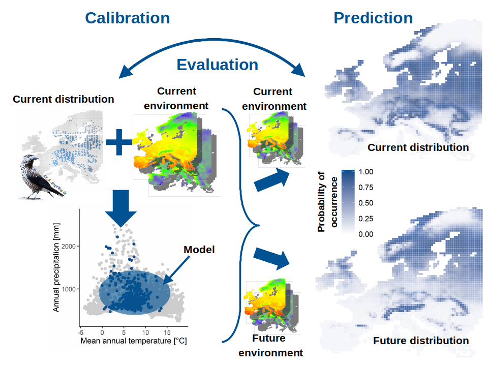
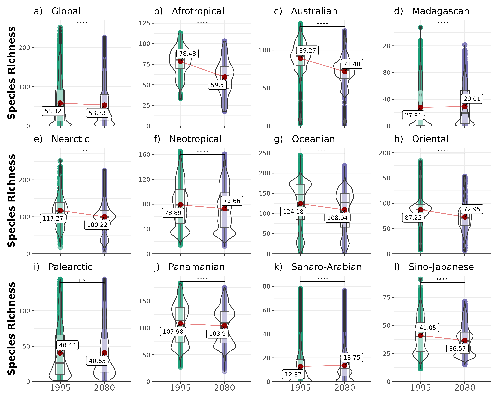
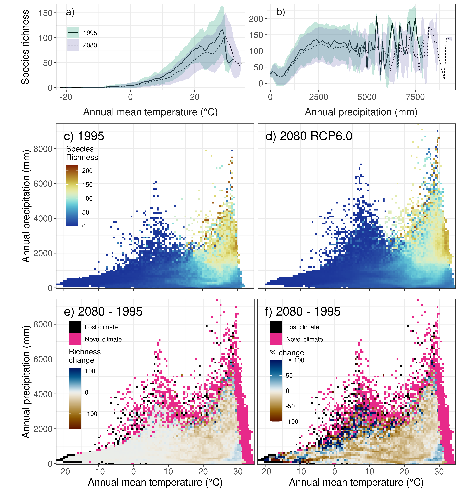
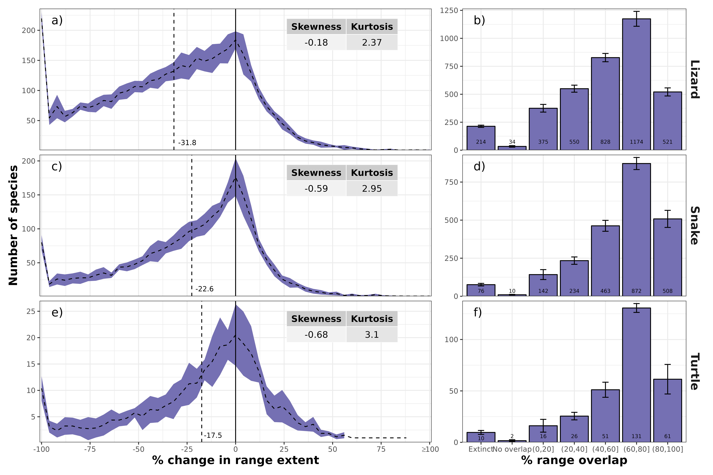
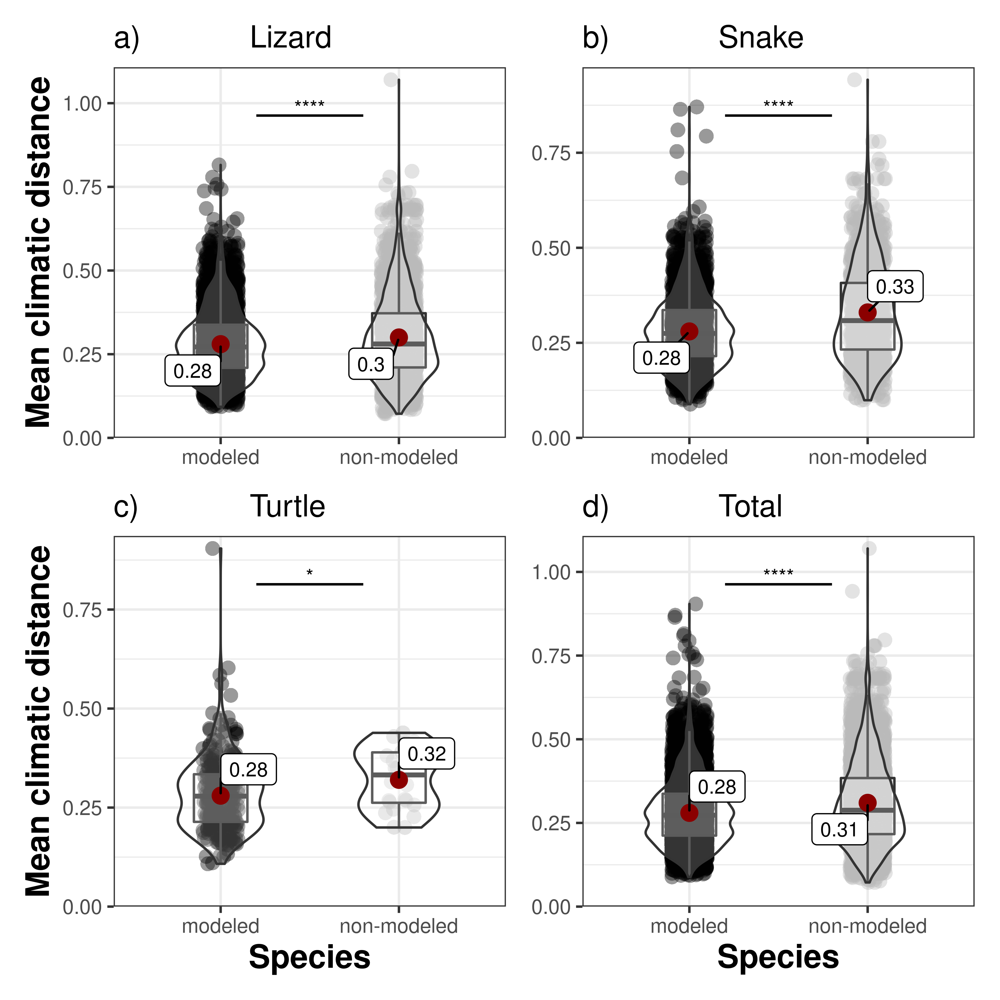

```{r setup, include=FALSE}
options(htmltools.dir.version = FALSE)
knitr::opts_chunk$set(
  fig.width=9, fig.height=3.5, fig.retina=3,
  out.width = "100%",
  cache = FALSE,
  echo = TRUE,
  message = FALSE, 
  warning = FALSE,
  hiline = TRUE
)
```

```{r xaringan-themer, include=FALSE, warning=FALSE}
library(xaringanthemer)
style_duo_accent(
  primary_color = "#1381B0",
  secondary_color = "#FF961C",
  inverse_header_color = "#FFFFFF"
)
```

## Future projections on biodiversity changes are manifold,

.pull-left[
*  Bioenergy cropland expansion may offset positive effects of climate change mitigation for global vertebrate diversity (Hof et al. 2018)
]

.pull-right[
```{r, echo=F, out.width = "85%"}
knitr::include_graphics("https://www.pnas.org/cms/10.1073/pnas.1807745115/asset/a9a24534-73db-400d-beb0-2f24bb3ad900/assets/graphic/pnas.1807745115fig01.jpeg")
```
]

---

## Future projections on biodiversity changes are manifold,

.pull-left[
*  Bioenergy cropland expansion may offset positive effects of climate change mitigation for global vertebrate diversity (Hof et al. 2018)

*  Uncertainty in ensembles of global biodiversity scenarios (Thuiller et al. 2019)
]

.pull-right[
```{r, echo=F, out.width = "90%"}
knitr::include_graphics("https://media.springernature.com/full/springer-static/image/art%3A10.1038%2Fs41467-019-09519-w/MediaObjects/41467_2019_9519_Fig1_HTML.png")
```
]

---

## Future projections on biodiversity changes are manifold,

.pull-left[
*  Bioenergy cropland expansion may offset positive effects of climate change mitigation for global vertebrate diversity (Hof et al. 2018)

*  Uncertainty in ensembles of global biodiversity scenarios (Thuiller et al. 2019)

* ...
]

.pull-right[
]

**but mostly focus on Amphibians, Mammals and Birds!**

---
class: large

## While future projections on reptile diversity are still rare

.pull-left[
*  Predicted species richness under future climate change, for **(a) amphibians, (b) birds, (c) mammals and (d) reptiles**.

*  Error bars show estimated uncertainty expressed as the range of estimates across the distribution model ensemble.

.footnote[Newbold (2018)]
]

.pull-right[
```{r, echo=F, out.height = "60%"}
knitr::include_graphics("https://royalsocietypublishing.org/cms/asset/913910bd-4b75-4316-96bc-d02ba3ce70b6/rspb20180792f02.jpg")
```
]

---

## Although, new reptile data is available

.pull-left[
*  Global Assessment of Reptile Distributions
    
    - Global range maps of 10064 reptile species
    
    - 3 subgroups: c) 6415 lizards, d) 3414 snakes, and e) 235 turtles

    - **ca. 45 % more species than IUCN range maps!**

.footnote[Roll et al. (2017)]
]

.pull-right[
```{r, echo=F, out.height = "80%"}
knitr::include_graphics("https://media.springernature.com/full/springer-static/image/art%3A10.1038%2Fs41559-017-0332-2/MediaObjects/41559_2017_332_Fig1_HTML.jpg")
#https://media.springernature.com/m312/springer-static/image/art%3A10.1038%2Fs41559-017-0332-2/MediaObjects/41559_2017_332_Fig1_HTML.jpg
```

]

---

## Questions

*  Q1: How is global reptile species richness affected by climate change?

--

* Q2: Which regions are specifically affected?

--

*  Q3: How is changing species related to changes in precipitation and temperature?

--

*  Q4: How is the range extent and range overlap affected by climate change?

--

*  Q5: How is the range position affected by climate change and how does this differ among regions? 

--

*  Q6: How do climatic conditions change across modelled and non-modelled species?

<!--
#---

## Methods – Species distributions

*  Global Assessment of Reptile Distributions (Roll et al. 2017)

    - Global range maps of 10064 reptile species

    - 3 subgroups: 6415 lizards, 3414 snakes, and 235 turtles

    - ca. 45 % more species than IUCN range maps!

#--
    - **gridded to 0.5°**

#--

*  Pseudo-absences:

    - distance-weighted randomly selected grid cells

    - n = number of presences, but minimum 1000 cells

    - repeated 10 times

#---

## Methods – Climate Data

*  Current:

    - EWEMBI climate data (0.5°, Lange 2017)

    - Daily observed temperature and precipitation over 30-yr time period (1980 - 2009)

=> **19 bioclimatic variables for 1 time period**

#--

*  Future:

    - CMIP5 simulated climate data (0.5°, Frieler et al. 2017)

    - 4 Global Climate Models (GCMs): GFDL-ESM2M, HadGEM2-ES, IPSL-CM5A-LR, MIROC5

    - 3 Representative Concentration Pathways (RCPs): RCP2.6, RCP6.0, RCP8.5

    - 2 x 30-yr time periods: 2050 (2036 - 2065), 2080 (2066 – 2095)

=> **19 bioclim variables for 12 scenarios and 2 time periods**
-->

---

## Methods – Species Distribution Models

```{r, echo=F, out.width = "55%", fig.align='center'}

```

*  Explanatory variable: (Bio)climatic information (1980 - 2009)
*  Response variable: Presence/Absence of species (gridded range maps)

<!--
#---

## Methods – Models

*  Variable Selection:
    
    - Pre-selection of 10 most-commonly used variables
    
    - Identify possible combinations of 3 & 4 variables with a low Pearson correlation (p < 0.7)

#--

*  Identify optimal variable combination:
    
    - combination with highest accuracy out of 36 tested combinations
    
    - tested on 10 % of all species using GAMs

=> **4 bioclimatic variables: bio4 = Temperature seasonality, bio5 = Max temperature of warmest month, bio12 = Annual precipitation, bio15 = Precipitation seasonality**

#---

## Methods – Models

*   Model algorithms:
    
    - Generalized Additive Models (GAMs)
    
    - Generalized Boosted Regression Models (GBMs)

#--

*  Spatial autocorrelation
    
    - Spatial blocking (n > 50): 10 blocks, representative climate space per ecoregion => N = ...
    
    - 30/70 Split (n ≤ 50) => N = ...
    
    - Species with n < 10 were removed (N = ...)
    
#--

*  Model accuracy
    
    - Only keep species with average model accuracy > 0.7

=> **100 models per species (N = 6296)**
-->

---

## Methods – Analysis

*  **Predict** models to current and future conditions (48 scenarios: 4 GCMs, 3 RCPs, 2 Years, 2 Model algorithms)

--

*  **Threshold** species-specific predictions to binary values, using true skill statistic (TSS)

--

*  **Dispersal ability** is restricted using species-species buffers:
    - 3 different dispersal scenarios (d/4, d/8, d/16 where d is the range diameter)

|Scenario                      |d/4       |d/8       |d/16      |
|:-----------------------------|:---------|:---------|:---------|
|Mean distance                 |410       |205       |102       |
|Mean distance (yr-1) - 2050   |7.45      |3.73      |1.86      |
|Mean distance (yr-1) - 2080   |4.82      |2.41      |1.21      |
|Median distance               |262       |131       |65.6      |
|Median distance (yr-1) - 2050 |4.77      |2.38      |1.19      |
|Median distance (yr-1) - 2080 |3.09      |1.54      |0.77      |


<!--
    - 6 different dispersal scenarios (d, d/2, d/4, d/8, d/12, d/16 where d is the range diameter) 
    - no & full dispersal


|Scenario                      |d     |d/2       |d/4       |d/8       |d/12      |d/16      |
|:-----------------------------|:-----|:---------|:---------|:---------|:---------|:---------|
|Mean distance                 |1640  |820       |410       |205       |137       |102       |
|Mean distance (yr-1) - 2050   |29.8  |14.9      |7.45      |3.73      |2.48      |1.86      |
|Mean distance (yr-1) - 2080   |19.3  |9.65      |4.82      |2.41      |1.61      |1.21      |
|Median distance               |1049  |524       |262       |131       |87.4      |65.6      |
|Median distance (yr-1) - 2050 |19.1  |9.53      |4.77      |2.38      |1.58      |1.19      |
|Median distance (yr-1) - 2080 |12.3  |6.17      |3.09      |1.54      |1.03      |0.77      |
-->


<!--
#---

## Methods – Analysis

*  Calculate increase, decrease and net change in species richness

#--

*  Compare richness changes among zoogeographic realms and the different taxonomic groups

#--

*  Define common grid cell according to climatic space (temperature and precipitation) and calculate the change in richness for each combination of conditions

#--

*  Calculate species-specific change in extent of occurrence and the directional shift in occurrence (still to be completed)
-->

---
background-image: url("figures/Figure1.png")
background-position: center
background-size: contain

## Results

<!--
```{r, echo=F, out.width = "45%", fig.align='center'}
knitr::include_graphics("figures/Figure1.png")
```
-->

---
background-image: url("figures/Figure2.png")
background-position: center
background-size: 60%, 75%

## Results

<!--
```{r, echo=F, out.width = "60%", fig.align='center'}

```
-->

---
background-image: url("figures/Figure3.png")
background-position: center
background-size: contain

## Results

<!--
```{r, echo=F, out.width = "45%", fig.align='center'}

```
-->

---
background-image: url("figures/Figure4.png")
background-position: center
background-size: contain

## Results

<!--
```{r, echo=F, out.width = "60%", fig.align='center'}

```
-->

---
background-image: url("figures/Figure5.png")
background-position: center
background-size: 69%, 92%

## Results

<!--
```{r, echo=F, out.width = "65%", fig.align='center'}
knitr::include_graphics("figures/Figure5.png")
```
-->

---
background-image: url("figures/Figure6.png")
background-position: center
background-size: contain

## Results

<!--
```{r, echo=F, out.width = "50%", fig.align='center'}

```
-->

---

## Summary

*  Q1: Area that decreases in reptile richness is larger than area where richness increases and decrease is often more pronounced.

--

*  Q2: Reptile richness significantly declines with increasing warming globally and across most zoogeographic realms.

--

*  Q3: Strongest changes mostly occur in extreme temperature and precipitation conditions.

--

*  Q4: Changes in extent of occurrence are negatively skewed. And a lot of species loss a significant proportion of the original range extent.

--

*  Q5: Changes in range position strongly varied across taxa and realm, with a northward shift in lizards and a southward shift in snakes and turtles.

--

*  Q6: Non-modeled species are stronger affected by climatic changes than modeled species.

---
class: center, middle

# Thank you for your attention!
